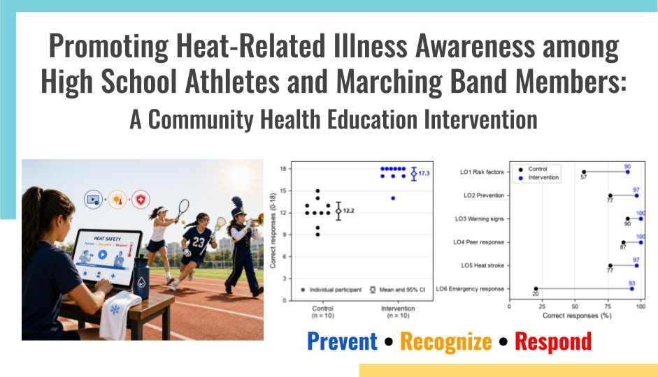

<!--
## Promoting Heat-Related Illness Awareness among High School Athletes and Marching Band Members: A Community Health Education Intervention
-->

  

### Short Summary 

Heat-related illnesses (HRIs), such as heat cramps, heat exhaustion, and heat stroke, pose a preventable but potentially life-threatening risk to high school athletes and marching band members. To address this risk, this project proposes an evidence-based, low-cost educational intervention to improve students’ ability to prevent, recognize, and respond to HRIs. The intervention uses a 10-minute, self-paced online educational module structured around six evidence-based learning objectives. HRI knowledge is assessed through a randomized controlled experiment comparing intervention and control groups. Preliminary results indicate a substantial short-term effect on HRI knowledge and support the feasibility of online implementation.

### Extended Summary

<!--
Heat-related illnesses (HRIs), including heat cramps, heat exhaustion, and heat stroke, occur when heat exposure, physical exertion, or both exceed the body’s ability to regulate temperature. HRIs are a leading cause of athlete deaths, and most victims are teenagers. Beyond fatal cases, thousands of high school athletes are treated each year. Marching band members also face heat risk, especially in full uniforms and while carrying instruments. 

HRI risk is not limited to traditionally hot climates or summer months. Insufficient acclimatization can increase risk during early-season practices or rehearsals, even in cooler regions. Severe heat stroke is particularly time-sensitive and requires rapid recognition and cooling to prevent organ damage or death. Risk factors include environmental conditions such as heat, humidity, sun exposure, limited airflow, and radiant heat from surfaces, as well as individual and activity-related factors such as dehydration, prior heat illness, inadequate sleep, medications, prolonged exertion, and heat-retaining equipment or uniforms.

Since these factors interact, prevention requires more than hydration. Effective prevention includes gradual acclimatization, environmental monitoring, activity modification, symptom recognition, trained personnel, emergency action plans, and education. This project develops and pilots a community health education module to improve HRI prevention, recognition, and response knowledge among high school athletes and marching band members.
-->

### Publications

- H. Suzuki, A Heat-Related Illness Education Intervention for High School Athletes and Marching Band Members

<!--
### Presentations 
-->

### Relevant Projects

This project is closely related to the [AlertAthlete](https://github.com/HSSBoston/alertathlete/) project, which develops a machine learning-based algorithm for HRI risk esitmation and implements a supporting wearable device. You may find the [SipLog](https://github.com/HSSBoston/sip-log) project relevant/interesting too. 

### Personal Context

Last April, I experienced symptoms of heat-related illness (HRI) in a tennis match. One of my teammates developed more severe symptoms and was transported by ambulance for evaluation. It was not an isolated incident—I have seen HRIs affect teammates over multiple seasons. What surprised me most was that these episodes happened in spring in Massachusetts, not midsummer. That left me frustrated, but also motivated me to learn more and eventually start this project.

As I researched the issue, I learned that what I had seen on the tennis court was not unusual. Heat risk is not limited to midsummer or hot climates; students can be especially vulnerable early in the season, before their bodies have had time to adjust to the heat. Yet this risk is not always communicated to students; my school and neighboring teams, for example, lack preseason heat-safety education. I also found that many exisiting student-focused interventions emphasize hydration without fully addressing prevention, early recognition, and emergency response. My own experience, what I saw happen to my teammates, and the gaps I found in existing education shaped this project: an effort to give students HRI knowledge I wish my teammates and I had received before stepping onto the court.

